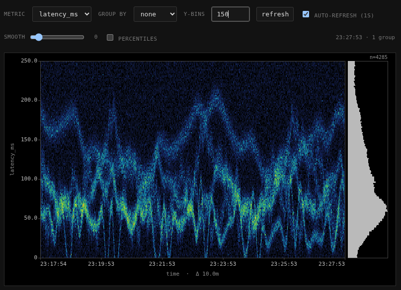
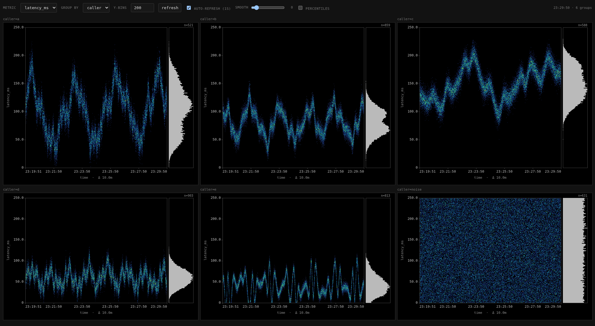

# Spectroscope

An in-process metric recorder that exposes a spectrogram-style heatmap
view over emitted observations. .

For each measure, Spectroscope produces:

- a **spectrogram**: x-axis = time bucket, y-axis = value bin, color =
  count of observations in that (time, value) cell.
- a **histogram**: aggregate counts per y-bin, drawn vertically next to
  the spectrogram and pixel-aligned to it.
- **percentiles** (p50, p75, p99) computed exactly over the contributing
  values.

Results can be returned for the whole population or split by any of the
configured dimensions.

## Library usage

```go
import (
    "context"
    "time"
    "spectroscope/spectro"
)

ss := spectro.New(
    time.Second,            // bucket precision
    600,                    // history length (number of buckets retained)
    []string{"caller"},     // dimensions on which Observations are tagged
    []string{"latency_ms"}, // measures to record
)

ctx, cancel := context.WithCancel(context.Background())
defer cancel()
go ss.Start(ctx)

// Anywhere in your application, record an observation:
ss.Emit(spectro.Observation{
    Time:       time.Now(),
    Dimensions: map[string]string{"caller": "frontend"},
    Measures:   map[string]float64{"latency_ms": 17.4},
})
```

### Querying programmatically

```go
groups, err := ss.Query(spectro.SpectrogramQuery{
    Measure: "latency_ms",
    YBins:   40,
    GroupBy: "caller", // empty string = single aggregate group
})
// groups is []SpectrogramGroup, each containing a Spectrogram,
// Histogram, and Percentiles for its slice of the data.
```

### Mounting the HTTP UI

```go
mux := http.NewServeMux()
mux.Handle("/spectrogram/", http.StripPrefix("/spectrogram", ss.Handler()))
http.ListenAndServe(":6060", mux)
```

Open `http://localhost:6060/spectrogram/ui` in a browser.

## HTTP API

The handler exposes three endpoints, all relative to whatever prefix you
mount it under (in the demo: `/spectrogram`):

| Path                       | Description                                                |
|----------------------------|------------------------------------------------------------|
| `GET /ui`                  | Embedded interactive UI                                    |
| `GET /_metrics`            | `{metrics: [...], dimensions: [...]}` for discovery        |
| `GET /{measure}`           | One or more `SpectrogramGroup` objects as JSON             |

Query parameters on `GET /{measure}`:

- `yBins` (int, default 20) — number of vertical bins.
- `groupBy` (string, optional) — dimension name to split on. When set,
  the response contains one group per distinct value of that dimension,
  each with its own spectrogram/histogram/percentiles, all sharing the
  same y-scale so they're directly comparable.

Example:

```
curl 'http://localhost:6060/spectrogram/latency_ms?yBins=40&groupBy=caller'
```

## Demo binary

`main.go` is a self-contained demo that constructs a SpectroscopeServer with
one dimension (`caller`) and one measure (`latency_ms`), spins up six
synthetic emitters, and serves the UI on `:6060`.

```
go run .
# then visit http://127.0.0.1:6060/spectrogram/ui
```

The six emitters are:

- `a`, `b`, `c`, `d`, `e` — each a *multi-wave* signal: the sum of
  several sine components whose amplitude and frequency each drift on
  their own slow cycle. Each has a distinct character (slow stately
  carrier, busy three-band, bursty silent-then-loud, etc.) — see
  `emitMultiWave` in `main.go`.
- `noise` — uniform random over `[0, 250)`.

## Web UI



The UI auto-discovers the configured metrics and dimensions on load.
Controls along the top:

- **metric** — which measure to display.
- **group by** — dimension to split on. `none` shows a single aggregate.
- **y-bins** — vertical resolution of the spectrogram and histogram.
- **refresh** / **auto-refresh** — manual or polled (1s) updates.
- **smooth** — slider from 0 to 10. At 0 the spectrogram renders as
  crisp pixels; above 0, it's bilinear-interpolated and then Gaussian
  blurred by the slider value in pixels. The histogram stays crisp at
  any setting.
- **percentiles** — toggles horizontal markers for p50 (solid), p75
  (dashed), p99 (dotted) drawn across both the spectrogram and the
  histogram, with the numeric value labeled at the right.

Each cell renders:

- a spectrogram (left, scaled to fill available space),
- a vertically-oriented histogram (right strip, same color for all bars,
  pixel-aligned so each y-bin in the histogram is the exact same row
  range as in the spectrogram),
- optional percentile markers spanning both.

### How "group by" tells the synthetic signals apart

With `group by = none`, all six callers are folded into one spectrogram.
The result is a fog: `noise`'s uniform `[0, 250)` distribution smears
across the entire y-axis and washes out everything else, and the
distinct rhythms of `a`/`b`/`c`/`d`/`e` overlap into a single muddled
band somewhere in the middle.



With `group by = caller`, the page splits into a grid — one
spectrogram per caller, all sharing the same y-scale so the magnitudes
are directly comparable. The character of each signal becomes obvious:

- **`a`**: a thick low-frequency band wandering around 100 ms with
  visible breathing in amplitude.
- **`b`**: tighter band around 80 ms, faster tempo.
- **`c`**: stately, high-mean (~150 ms), very slow drift.
- **`d`**: three overlapping frequency bands stacked on each other.
- **`e`**: clearly bursty — periods of silence near 40 ms followed by
  loud excursions when the wide-amplitude layer comes back.
- **`noise`**: a uniform vertical block from 0 to 250 — visibly *not*
  signal.

## License

MIT — see [LICENSE](LICENSE).
