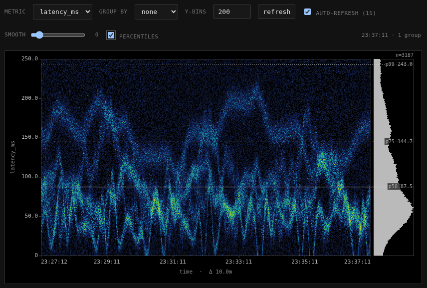

# Spectroscope

An in-process metric recorder that exposes spectrogram-style heatmaps view over emitted
observations. Results are streamed to your browser in hifi at 1 second resolution.



For each measure, Spectroscope produces:

- a **spectrogram**: x-axis = time bucket, y-axis = value bin, color =
  count of observations in that (time, value) cell.
- a **histogram**: aggregate counts per y-bin, drawn vertically next to
  the spectrogram and pixel-aligned to it.
- **percentiles** (p50, p75, p99) computed exactly over the contributing
  values.

Results can be returned for the whole population or split by any of the
configured dimensions.

## Library usage

```go
import (
    "context"
    "time"
    "spectroscope/spectro"
)

ss := spectro.New(
    time.Second,            // bucket precision
    600,                    // history length (number of buckets retained)
    []string{"caller"},     // dimensions on which Observations are tagged
    []string{"latency_ms"}, // measures to record
)

ctx, cancel := context.WithCancel(context.Background())
defer cancel()
go ss.Start(ctx)

// Anywhere in your application, record an observation:
ss.Emit(spectro.Observation{
    Time:       time.Now(),
    Dimensions: map[string]string{"caller": "frontend"},
    Measures:   map[string]float64{"latency_ms": 17.4},
})
```

### Querying programmatically

```go
groups, err := ss.Query(spectro.SpectrogramQuery{
    Measure: "latency_ms",
    YBins:   40,
    GroupBy: "caller", // empty string = single aggregate group
})
// groups is []SpectrogramGroup, each containing a Spectrogram,
// Histogram, and Percentiles for its slice of the data.
```

### Mounting the HTTP UI

```go
mux := http.NewServeMux()
mux.Handle("/spectrogram/", http.StripPrefix("/spectrogram", ss.Handler()))
http.ListenAndServe(":6060", mux)
```

Open `http://localhost:6060/spectrogram/ui` in a browser.

## HTTP API

The handler exposes three endpoints, all relative to whatever prefix you
mount it under (in the demo: `/spectrogram`):

| Path                       | Description                                                |
|----------------------------|------------------------------------------------------------|
| `GET /ui`                  | Embedded interactive UI                                    |
| `GET /_metrics`            | `{metrics: [...], dimensions: [...]}` for discovery        |
| `GET /{measure}`           | One or more `SpectrogramGroup` objects as JSON             |

Query parameters on `GET /{measure}`:

- `yBins` (int, default 20) — number of vertical bins.
- `groupBy` (string, optional) — dimension name to split on. When set,
  the response contains one group per distinct value of that dimension,
  each with its own spectrogram/histogram/percentiles, all sharing the
  same y-scale so they're directly comparable.

Example:

```
curl 'http://localhost:6060/spectrogram/latency_ms?yBins=40&groupBy=caller'
```

## Web UI


The UI auto-discovers the configured metrics and dimensions on load and
renders one tile per group. Each tile is composed of three
pixel-aligned layers over the same y-scale:

- **spectrogram** (left, fills available space): each column is one
  time bucket, each row is one value bin, and color encodes the count
  of observations that fell into that (time, value) cell. Reading
  vertically tells you the value distribution at a moment in time;
  reading horizontally tells you how a single value bin's activity
  evolves.
- **histogram** (right strip): the same y-bins aggregated across the
  entire visible time window. It uses the identical row-to-y mapping
  as the spectrogram, so a row at height `h` in one is the same value
  range as the row at height `h` in the other — useful for spotting
  long tails that are too faint to see in the heatmap.
- **percentile markers** (optional, span both): horizontal lines for
  p50 (solid), p75 (dashed), and p99 (dotted), computed exactly over
  every contributing value (not bucketed), with the numeric value
  labeled at the right edge.

Controls along the top:

- **metric** — which measure to display.
- **group by** — dimension to split on. `none` shows a single aggregate
  tile; otherwise the page splits into one tile per distinct value of
  the chosen dimension, all sharing the same y-scale so magnitudes are
  directly comparable.
- **y-bins** — vertical resolution of the spectrogram and histogram.
- **refresh** / **auto-refresh** — manual or polled (1s) updates.
- **smooth** — slider from 0 to 10. At 0 the spectrogram renders as
  crisp pixels; above 0, it's bilinear-interpolated and then Gaussian
  blurred by the slider value in pixels. The histogram stays crisp at
  any setting so long-tail counts remain readable.
- **percentiles** — toggles the p50/p75/p99 markers described above.
  Off by default.

## Demo binary

`main.go` is a self-contained demo that constructs a SpectroscopeServer with
one dimension (`caller`) and one measure (`latency_ms`), spins up six
synthetic emitters, and serves the UI on `:6060`.

```
go run .
# then visit http://127.0.0.1:6060/spectrogram/ui
```

The six emitters are:

- `a`, `b`, `c`, `d`, `e` — each a *multi-wave* signal: the sum of
  several sine components whose amplitude and frequency each drift on
  their own slow cycle. Each has a distinct character (slow stately
  carrier, busy three-band, bursty silent-then-loud, etc.) — see
  `emitMultiWave` in `main.go`.
- `noise` — uniform random over `[0, 250)`.

### How "group by" tells the synthetic signals apart

With `group by = none`, all six callers are folded into one spectrogram.
The result is a fog: `noise`'s uniform `[0, 250)` distribution smears
across the entire y-axis and washes out everything else, and the
distinct rhythms of `a`/`b`/`c`/`d`/`e` overlap into a single muddled
band somewhere in the middle.


With `group by = caller`, the page splits into a grid — one
spectrogram per caller, all sharing the same y-scale so the magnitudes
are directly comparable. The character of each signal becomes obvious:

## License

MIT — see [LICENSE](LICENSE).
